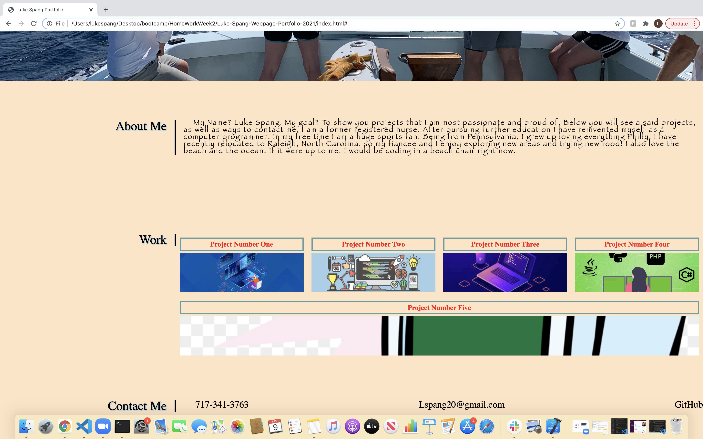

# Luke-Spang-Webpage-Portfolio-2021

This project is a portfolio webpage for Luke Spang.  On this webpage potential employeers can view recent projects, as well as learn a little more about Luke Spang the person. They will also be able to find ways of getting in contact with Mr. Spang. Finally the webpage itself showcases some of Luke's skills formatting the front end of a webpage with html and css. 

When the webpage is loaded viewers are presented with

1. previous work (once previous work to link to is available)
2. A recent picture (current picture is from this past summer. I am fishing in the blue shirt with the hat. a more professional picture will be used when available)
3. nav links that scroll to the specified sections.
4. The first application image is the largest.
5. links for the applications will direct viewers to the deployed applications (when available)
6. Finally the webpage will adapt to various screens and devices with a responsive layout.

Below is the current status of the page

